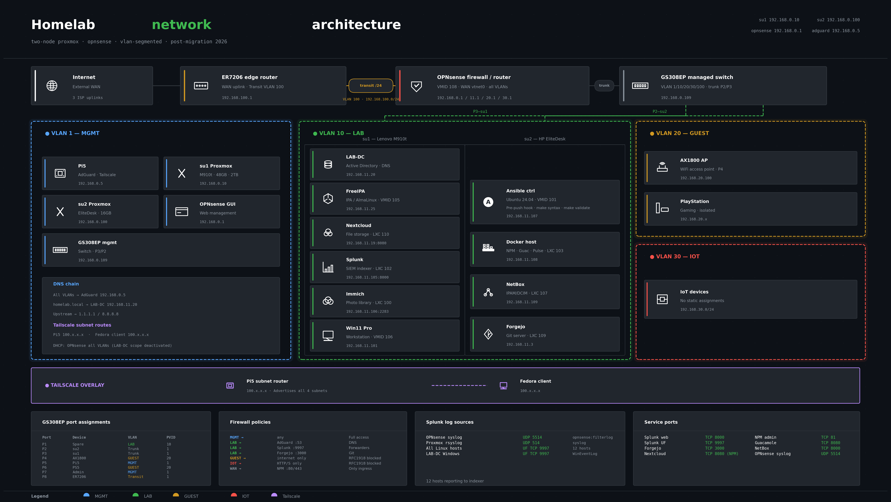

> **Status:** Infrastructure complete · Portfolio publication in progress · March 2026

# Homelab — VLAN-segmented two-node Proxmox lab

A complete renovation of a flat home network into a VLAN-segmented
infrastructure with OPNsense as the core firewall, centralized SIEM,
dual-identity management, and GitOps-driven automation.

## Architecture

## What I Built

Migrated a flat 192.168.11.0/24 network to a fully segmented architecture
across four VLANs — MGMT, LAB, GUEST, and IOT — with OPNsense handling
all inter-VLAN routing and firewall policy on a single-NIC router-on-a-stick
configuration. All 12 hosts are managed via Ansible with lint-clean roles
at 0 violations. Splunk ingests logs from every source in the lab across
7 dashboards.

## Stack

| Layer | Technology |
|---|---|
| Hypervisor | Proxmox VE — two nodes (Lenovo M910t, HP EliteDesk) |
| Firewall / router | OPNsense VM — single vNIC, VLAN sub-interfaces |
| Switching | Netgear GS308EP — 5 VLANs, tagged trunks |
| DNS / filtering | AdGuard Home on Raspberry Pi 5 |
| DHCP | Dnsmasq via OPNsense — all four VLANs |
| SIEM | Splunk Enterprise — 7 dashboards, forwarders on all hosts |
| Automation | Ansible — common_linux + splunk_forwarder roles, 0 lint violations |
| Identity | Windows Server 2022 AD + FreeIPA on AlmaLinux |
| Source control | Forgejo (self-hosted) + pre-push lint/syntax CI |
| Remote access | Tailscale — Pi5 subnet router for all VLANs |
| Photo backup | Immich LXC |

## VLANs

| VLAN | Subnet | Purpose |
|---|---|---|
| 1 MGMT | 192.168.0.0/24 | Proxmox nodes, OPNsense, switch, Pi5 |
| 10 LAB | 192.168.11.0/24 | All lab VMs and services |
| 20 GUEST | 192.168.20.0/24 | Home WiFi — internet only |
| 30 IOT | 192.168.30.0/24 | IoT devices — isolated, HTTP/S only |
| 100 Transit | 192.168.100.0/24 | ER7206 → OPNsense WAN handoff |

## Repos

| Repo | Contents |
|---|---|
| [homelab-runbooks](../homelab-runbooks) | Ansible roles, playbooks, Makefile, pre-push CI |
| [-network-documentation](../-network-documentation) | VLAN design, firewall rules, switch config |
| [docker-stack](../docker-stack) | Self-hosted Docker Compose service stack |
| [active-directory-lab](../active-directory-lab) | AD OU design, GPOs, FreeIPA HBAC policy |
| [powershell-scripts](../powershell-scripts) | AD provisioning and automation scripts |

## Internal Repos (self-hosted Forgejo at 192.168.11.3)

- `ansible-homelab` — full playbooks, roles, inventory, vault
- `homelab-docs` — master plan and runbooks
- `docker-compose-stack` — Docker host compose files

---

**Built by:** Lamar Scott
**Email:** scottlamar05@gmail.com
**LinkedIn:** https://linkedin.com/in/lamar-s-b02100260/
**GitHub:** https://github.com/lamsec94
